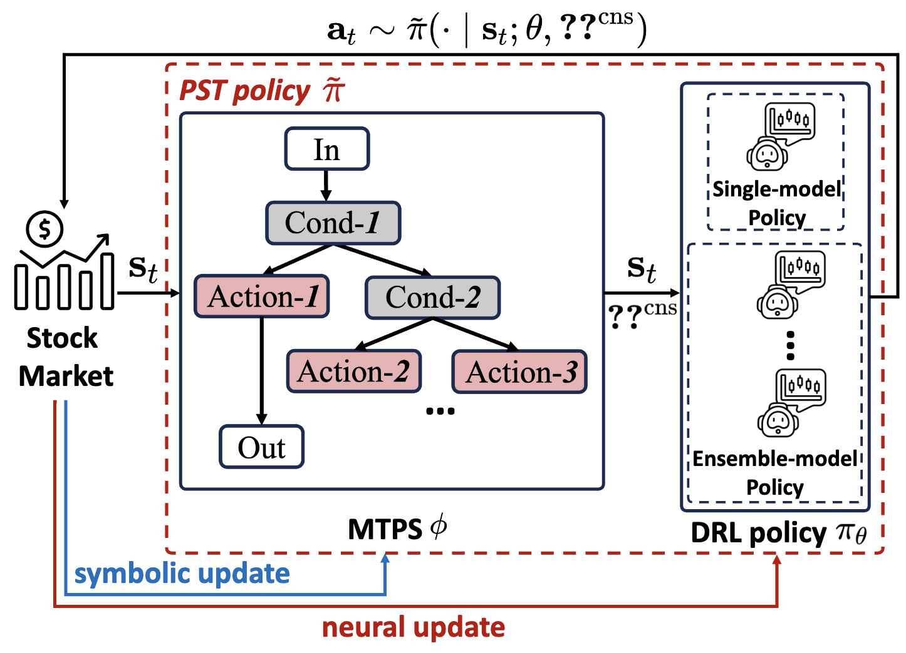
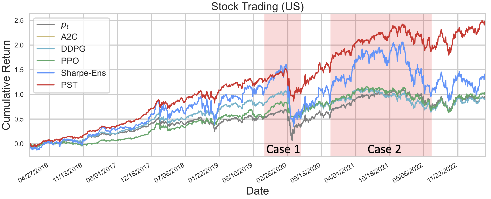

# PST: Improving Quantitative Trading via Program Sketch-based Tuning

This repo provides the code for reproducing the stock trading experiments in the KDD'24 submission **PST: Improving Quantitative Trading via Program Sketch-based Tuning**. 


*Overview of the PST framework.*

## Dependencies
- Python 3.7 
- tensorflow 2.11.0
- gym 0.21.0
- gym-minigrid 1.0.2
- numpy 1.19.5
- yfinance 0.2.3
- finrl 0.3.5 

### Usage
We provide the PST implementation and PST w/o MTPS on two stock markets: HK, US. 
For example, the command for reporducing the US market results (PST):
```
cd ./st_us
python main.py
```

For backtesting the trained model, please refer to the provided code in **./st_us/backtest.ipynb**.
The backtesting result on the US stock market (cash trading) is as follows:

*Cumulative return curve of different methods.*
